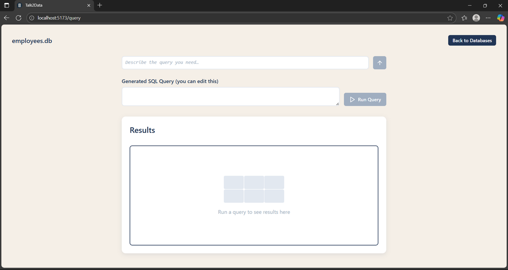
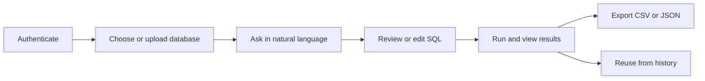

# Talk2Data Frontend

The React and Vite interface for Talk2Data, a full-stack application that lets users ask questions about SQLite databases in plain English, review the generated SQL, and explore the results in a clean table view.

[View the Node.js backend](https://github.com/MohammdS/NaturalQueryExplorerProject-Tsofen-BackEnd)

<p align="center">
  
</p>

## Highlights

- Sign-up, sign-in, email verification, and password-reset flows
- SQLite upload and empty-database creation
- Natural-language query input with editable generated SQL
- Clear table rendering for query results
- CSV and JSON export
- Searchable query history with date and database filters
- Responsive loading, validation, and error states

## Application flow


```mermaid
flowchart LR
    Auth["Authenticate"] --> Databases["Choose or upload database"]
    Databases --> Question["Ask in natural language"]
    Question --> Review["Review or edit SQL"]
    Review --> Results["Run and view results"]
    Results --> Export["Export CSV or JSON"]
    Results --> History["Reuse from history"]
```

The frontend is divided into focused page-level flows:

| Page | Purpose |
| --- | --- |
| Authentication | Account creation, verification, sign-in, and recovery |
| Databases | Upload, create, download, and remove SQLite databases |
| Query | Generate, edit, execute, and export SQL results |
| History | Search, filter, and reuse earlier queries |

## Run locally

### Requirements

- Node.js 18 or newer
- The [Talk2Data backend](https://github.com/MohammdS/NaturalQueryExplorerProject-Tsofen-BackEnd) running locally

### Setup

```bash
npm install
cp .env.example .env
npm run dev
```

Open `http://localhost:5173` in your browser.

### Configuration

`VITE_API_BASE_URL` sets the backend base URL and defaults to `http://localhost:3000`.

## Scripts

| Command | Purpose |
| --- | --- |
| `npm run dev` | Start the Vite development server |
| `npm run build` | Create a production build |
| `npm run lint` | Run ESLint |
| `npm run preview` | Preview the production build locally |

## Technology

- React 19
- Vite 7
- React Router
- JavaScript and CSS
- Fetch API

## Team

Built by Malak Awawde, Loay Asaad, Muhammad Matar, and Mohammad Selawe. Mohammad served as team lead.
