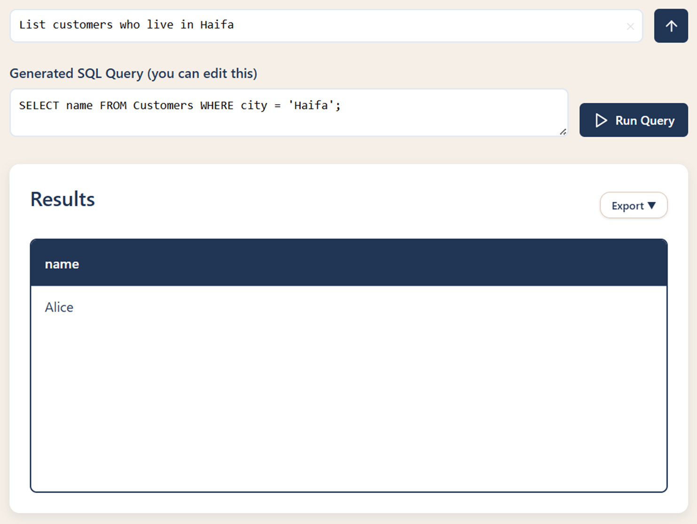
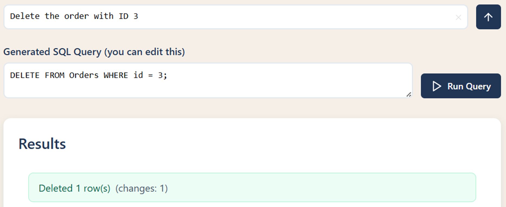

# React + Vite

This template provides a minimal setup to get React working in Vite with HMR and some ESLint rules.

Currently, two official plugins are available:

- [@vitejs/plugin-react](https://github.com/vitejs/vite-plugin-react/blob/main/packages/plugin-react) uses [Babel](https://babeljs.io/) for Fast Refresh
- [@vitejs/plugin-react-swc](https://github.com/vitejs/vite-plugin-react/blob/main/packages/plugin-react-swc) uses [SWC](https://swc.rs/) for Fast Refresh

## Expanding the ESLint configuration

If you are developing a production application, we recommend using TypeScript with type-aware lint rules enabled. Check out the [TS template](https://github.com/vitejs/vite/tree/main/packages/create-vite/template-react-ts) for information on how to integrate TypeScript and [`typescript-eslint`](https://typescript-eslint.io) in your project.

# Human Language for DB Query

This project demonstrates a Node.js backend architecture for modifying databases using human language commands. The structure follows best practices for maintainability and scalability.

## Project Structure

- `models/`: Contains OOP classes representing data entities (e.g., Customer, Order, etc.).
- `services/`: Handles business logic and data access (read/write operations).
- `controllers/`: Manages HTTP requests and responses, calling services as needed.
- `router/`: Maps API endpoints to controller functions.
- `middleware/`: Handles validation, logging, authentication, and other request/response processing.
- `utils/`: Utility functions (e.g., email, logging helpers).
- `data/`: Temporary storage for JSON data (simulating a database).

## How It Works

1. **Request Flow:**
   - A user sends a request (e.g., to modify or query data using natural language).
   - The request is routed via `router/` to the appropriate controller in `controllers/`.
   - The controller interprets the request and calls the relevant service in `services/`.
   - The service interacts with models in `models/` and reads/writes data from `data/`.
   - Middleware in `middleware/` can process requests for validation, logging, or authentication.
   - Utility functions in `utils/` support common tasks.
2. **Example:**
   - To add a new customer, a POST request is sent to `/api/customers`.
   - The router maps this to a controller, which calls a service to create the customer and store it in `data/customers.json`.

## Getting Started

1. Install dependencies: `npm install`
2. Start the server: `npm run dev` or `npm start`

# 🧠 Talk2Data

  

  <b>Query databases using natural language — powered by AI</b>

  
  
  
  
  

---

## 🧭 Table of Contents

1. [Team Members](#-team-members)
2. [Project Description](#-project-description)
3. [Target Audience](#-target-audience)
4. [Key Features](#-key-features)
   - [UI & UX](#️-ui--ux)
   - [Authentication Page](#-authentication-page)
   - [Databases Page](#️-databases-page)
   - [Add Database](#-add-database)
   - [Query Page](#-query-page)
5. [Our Unique AI Approach](#-our-unique-ai-approach)
6. [Sample Interactions](#-sample-interactions)
7. [History Page](#-history-page)
8. [Summary](#-summary)

---

## 👥 Team Members

- **Malak Awawde**
- **Loay Asaad**
- **Muhammad Matar**
- **Muhammad Selawy**

---

## 💡 Project Description

**Talk2Data** is a full-stack web application that enables users to query databases using **natural language** — powered by **AI**.

It translates English questions into accurate **SQL queries**, executes them, and displays the results in a clean format.  
The system makes **data exploration simple and intuitive**, even for non-technical users.

---

## 🎯 Target Audience

- Non-technical users needing easy DB access
- Business analysts requiring quick insights
- Students learning database concepts
- Small businesses with simple database needs

---

## 🌟 Key Features

### 🖥️ UI & UX

- Modern design with **card-based layouts**
- **Full query history** with timestamps
- Linked queries to specific databases
- User-friendly **errors** and **loading states**

---

### 🔐 Authentication Page

- **Sign Up / Sign In**
- **Email verification**
- **Strong password validation**

  

#### 🔑 JWT Token Authentication

  

#### 🔒 Password Hashing

  

#### 🔁 Password Reset (Token-Based)

  

    
    
  

---

### 🗄️ Databases Page

- Store up to **5 databases** per account
- Download / delete databases
- History and logout operations

  

---

### ➕ Add Database

- Upload `.db` / `.sqlite` files (up to **50MB**)
- Create **empty databases**
- File validation for **type & size**

  

#### ⚙️ Storing User Databases

- Uploaded files are stored **directly on the server’s disk**
- Only the file’s **metadata** is saved in the database
- Files are renamed with a **timestamp prefix** to avoid name collisions

  

---

### 💬 Query Page

Type in **plain English**, get **SQL + results instantly**

  

- Editable SQL: users can modify generated queries before running
- Export answers as **CSV** or **JSON**
- Results shown instantly in a clean **table view**

  

---

## 🧩 Our Unique AI Approach

### 🧠 Initial Idea

Send full database + prompt → GPT builds query

**Problems:**

- Not secure
- Very heavy
- Expensive

### 💡 Our Solution

Send only the **database schema** (tables + columns)

**Benefits:**

- Stronger **privacy**
- **Faster** execution
- **Cheaper** API usage

---

## 🧪 Sample Interactions

    
  

#### Insert Operations and More

    
    
    
    
    
    
    
  

---

## 📜 History Page

- Filter by **date** or **database**
- Search support
- **100-entry limit** — most recent queries per user
- Sorted by time, newest first

  

Past queries are reusable — users can review and re-run them with a single click.  
Selecting a saved query takes you back to the **Query Page** for re-execution and updated results.

---

## 🏁 Summary

**Talk2Data** bridges the gap between **human language** and **structured data**, making database interaction simple, powerful, and accessible.

Its **clean design**, **secure backend**, and **AI-powered querying** make it a practical tool for both education and business.

---

  <b>💻 Built with ❤️ by the Talk2Data Team</b>

